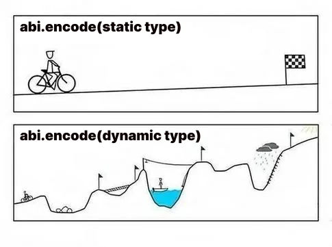

# WTF Solidity内部标准: 06. 动态类型的ABI编码

《WTF Solidity内部标准》教程将介绍Solidity智能合约中的存储布局，内存布局，以及ABI编码规则，帮助大家理解Solidity的内部规则。

推特：[@0xAA_Science](https://twitter.com/0xAA_Science)

社区：[Discord](https://discord.gg/5akcruXrsk)｜[微信群](https://docs.google.com/forms/d/e/1FAIpQLSe4KGT8Sh6sJ7hedQRuIYirOoZK_85miz3dw7vA1-YjodgJ-A/viewform?usp=sf_link)｜[官网 wtf.academy](https://wtf.academy)

所有代码和教程开源在github: [github.com/AmazingAng/WTF-Solidity-Internals](https://github.com/AmazingAng/WTF-Solidity-Internals)

-----

上一讲，我们介绍了静态类型的ABI编码规则。而在这一讲，我们将讲解更复杂的动态类型的ABI编码规则。



## 动态类型的ABI编码规则

我们可以把Solidity中的动态类型包括：

1. `bytes`和`string`。
2. 动态数组。
3. 动态类型`T`的定长数组`T[k]`，其中`k > 0`。
4. 由任意动态类型构成的元组。

静态类型是直接编码的，而动态类型是在当前数据槽之后的一个单独分配的位置进行编码，当前块记录只分配位置的偏移量。

### 动态数组

对于动态数组，编码时当前数据槽记录偏移量，然后记录动态数组的长度和每一个元素，它们分别占据一个单独的数据槽（`32`字节）。在下面的`testAbiArray()`中，我们定义了一个`uint[] memory a = new uint[](3)`，并返回它的ABI编码。

```solidity
function testAbiArray() public pure returns (bytes memory){
    uint[] memory a = new uint[](3);
    a[0] = 1;
    a[1] = 2;
    a[2] = 3;
    return abi.encode(a);
}
```

首先，`0x00`槽会记录偏移量，因为我们只编码一个数据，`uint[]`的长度和数值会在`0x20`开始记录，偏移量就是`0x20`。接下来，`0x20`槽会记录数组的长度，这里为`3`。`0x40`-`0x80`会分别记录数组的元素`[1, 2, 3]`。因此，编码后的结果为：

```
0x
0000000000000000000000000000000000000000000000000000000000000020
0000000000000000000000000000000000000000000000000000000000000003
0000000000000000000000000000000000000000000000000000000000000001
0000000000000000000000000000000000000000000000000000000000000002
0000000000000000000000000000000000000000000000000000000000000003
```

### `bytes`和`string`

`bytes`和`string`的编码方式相同，会在当前数据槽记录分配位置的偏移量，然后在分配的位置记录`bytes/string`的字节长度，接下来是字节内容，编码时会在右侧补若干`0`使其长度成为`32`字节的倍数。在下面的`testAbiString()`中，我们定义了`string memory b = "WTF"`，并返回它的ABI编码。

```solidity
function testAbiString() public pure returns (bytes memory){
    string memory b = "WTF";
    return abi.encode(b);
}
```

首先，`0x00`槽会记录偏移量`0x20`。接下来`0x20`槽会记录字符串长度`3`。最后，`0x40`槽会记录`"WTF"`的UTF8编码，并在右侧补若干`0`使其长度成为`32`字节，也就是`5754460000000000000000000000000000000000000000000000000000000000`。因此，编码后的结果为：

```solidity
0x
0000000000000000000000000000000000000000000000000000000000000020
0000000000000000000000000000000000000000000000000000000000000003
5754460000000000000000000000000000000000000000000000000000000000
```

### 动态类型的定长数组

动态类型的定长数组，比如`string[2]`，会在当前数据槽记录分配位置的偏移量，然后再在之后的槽中记录每个元素的偏移量，比如`string[0]`和`string[1]`的偏移量，最后记录元素的值。在下面的`testAbiStringStaticArray()`中，我们定义了`string[2] memory strings = ["WTF", "Academy"]`，并返回它的ABI编码。

```solidity
function testAbiStringStaticArray() public pure returns (bytes memory){
    string[2] memory strings = ["WTF", "Academy"];
    return abi.encode(strings);
}
```

首先，`0x00`槽会记录数组的偏移量`0x20`。接下来`0x20`和`0x40`槽分别记录`string[0]`和`string[1]`的偏移量，`0x40`和`0x80`。注意，这里的偏移量是相对于`0x20`槽的，而不是`0x00`的。然后`string[0]`，也就是`"WTF"`，会保存在`0x60-0x80`槽中（`0x20`偏移`0x40`）；`string[1]`，也就是`"Academy"`，会保存在`0xa0-0xc0`槽中（`0x20`偏移`0x80`）。因此，编码后的结果为：

```
0x
0000000000000000000000000000000000000000000000000000000000000020
0000000000000000000000000000000000000000000000000000000000000040
0000000000000000000000000000000000000000000000000000000000000080
0000000000000000000000000000000000000000000000000000000000000003
5754460000000000000000000000000000000000000000000000000000000000
0000000000000000000000000000000000000000000000000000000000000007
41636164656d7900000000000000000000000000000000000000000000000000
```

### 包含动态类型的元组/结构体

元组和结构体的编码方式相同，对于包含动态类型的元组/结构体，会在当前数据槽记录分配位置的偏移量，然后再分别编码成员：如果成员是静态类型，就直接在当前槽中编码；如果是动态类型，则先记录偏移量，再在后面分配的位置进行编码。在下面的合约中，我们定义了一个`DynamicStruct`结构体，它包含`3`个成员：`uint a`，`uint[] b`，和`string c`，后两者均为动态类型。函数`testAbiDynamicStruct`会返回`DynamicStruct`结构体的ABI编码。

```solidity
struct DynamicStruct { uint a; uint[] b; string c; }

function testAbiDynamicStruct() public pure returns (bytes memory){
    uint a = 99;
    uint[] memory b = new uint[](3);
    b[0] = 1;
    b[1] = 2;
    b[2] = 3;
    string memory c = "WTF";

    DynamicStruct memory ds = DynamicStruct(a, b, c);
    return abi.encode(ds);
}
```

首先，`0x00`槽会记录整个结构体的偏移量`0x20`。接下来开始记录数组成员，`0x20`槽记录`uint a`的值`99`（`0x63`），`0x40`槽记录`uint[] b`的偏移量`0x60`（相对槽`0x20`），`0x60`槽记录`string c`的偏移量`0xe0`（相对槽`0x20`）。最后，`0x80`-`0xe0`记录`uint[] b`的长度`3`和值`[1,2,3]`，`0x100-0x120`记录`string c`的字节长度`3`和值`575446`。因此，编码后的结果为：

```
0x
0000000000000000000000000000000000000000000000000000000000000020
0000000000000000000000000000000000000000000000000000000000000063
0000000000000000000000000000000000000000000000000000000000000060
00000000000000000000000000000000000000000000000000000000000000e0
0000000000000000000000000000000000000000000000000000000000000003
0000000000000000000000000000000000000000000000000000000000000001
0000000000000000000000000000000000000000000000000000000000000002
0000000000000000000000000000000000000000000000000000000000000003
0000000000000000000000000000000000000000000000000000000000000003
5754460000000000000000000000000000000000000000000000000000000000
```

## 其他ABI编码

这一章节总结一些特殊类型的ABI编码，方便大家理解。

### 动态类型的不定长数组

上面我们学习了动态类型的定长数组的ABI编码规则，现在我们看看动态类型的不定长数组是如何编码的。下面`testAbiStringArray()`函数中我们定义了一个`string[] strings`变量，并返回了它的ABI编码

```solidity
function testAbiStringArray() public pure returns (bytes memory){
    string[] memory strings = new string[](2);
    strings[0] = "WTF";
    strings[1] = "Academy";
    return abi.encode(strings);
}
```

首先，`0x00`槽记录不定长数组的偏移量`0x20`。接下来`0x20`槽中会记录不定长数组的长度`2`。之后槽`0x40`和`0x60`分别记录了`strings[0]`和`strings[1]`的偏移量`0x40`和`0x80`（相对于槽`0x40`）。最后，槽`0x80`-`0xa0`记录了`strings[0]`的字节长度和内容，槽`0xc0`-`0xe0`记录了`strings[1]`的字节长度和内容。因此，编码后的结果为：

```
0x
0000000000000000000000000000000000000000000000000000000000000020
0000000000000000000000000000000000000000000000000000000000000002
0000000000000000000000000000000000000000000000000000000000000040
0000000000000000000000000000000000000000000000000000000000000080
0000000000000000000000000000000000000000000000000000000000000003
5754460000000000000000000000000000000000000000000000000000000000
0000000000000000000000000000000000000000000000000000000000000007
41636164656d7900000000000000000000000000000000000000000000000000
```

## 总结

这一讲，我们介绍了Solidity合约中动态类型的ABI编码规则。相比于静态类型，动态类型的ABI编码规则要复杂得多，大家需要借助例子取理解它。